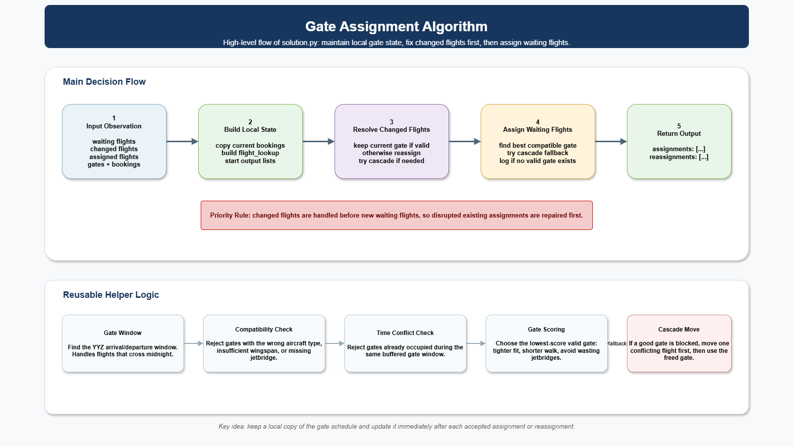

# Gate Assignment Subproblem
## Table of Contents

- [Challenge](#challenge)
- [Potential Solutions](#potential-solutions)
- [Getting Started](#getting-started)
- [Resources](#resources)

## The Problem
At Toronto Pearson Airport, a sudden gate malfunction forces an arriving aircraft to wait on the taxiway during a busy long weekend. Due to slow gate reassignment, passengers are left stuck on board. This leads to passengers missing connections and appointments. Inside the airport, crowds swell as other flights are also delayed, creating long walking distances and overwhelming staff. The airline ends up having to spend a significant amount of money on compensation and rebooking flights. The airline and airport are bombarded by complaints from very angry passengers from their customer service lines and on social media.

## Challenge
Ideally, the above scenario is something that airports want to avoid. As such, your challenge is to develop a solution that assigns airport gates to arriving and departing flights over time. Your solution must:

- Respect aircraft-gate compatibility
- Handle airline preferences and security concerns
- Adapt dynamically to delays, outages and emergencies (cascading changes)
- Minimize conflicts, delays and wasted time (optimization)

### Constraints 
The table below outlines some of that hard constraints that your solution must follow.
| Constraint | Rule |
| --- | --- |
| Occupancy | Two aircraft cannot use the same gate during overlapping intervals. |
| Aircraft size | The aircraft wingspan must fit the gate. |
| Jetbridge | An aircraft requiring a jetbridge must receive a jetbridge gate. |
| International | International flights require international gates. |
| Domestic | Domestic flights may use domestic or international gates, but international gates carry a soft penalty. |
| Cargo | Cargo flights require cargo gates; passenger flights cannot use them. |
| Gate outage | A flight cannot occupy a gate while that gate is unavailable. |
| Delay | An `UpdateTiming` message can extend a flight's gate-occupancy window. |
| Changed flight | A delay or equipment change may make the current gate invalid and require repair. |
| Reassignment | Moving an already assigned flight is allowed but adds a soft-score cost. |
| Walking distance | Gate distance contributes to the soft score. |

One thing that should be taken into consideration is that a=gate typing is asymmetric. International flights require international gates because of customs processing. Domestic flights may use domestic or international gates, although using an international gate adds a soft penalty. Cargo flights require cargo gates, and passenger flights (international and domestic) cannot use them.

When a flight cannot be placed safely, leave it unassigned instead of returning an invalid assignment. The solution should fail gracefully instead of crashing.

### Choosing a scope
Make sure to pick a scope you can actually finish. A good solution should be able to answer questions such as:

- Can the plan handle a full day's schedule and the disruptions that land on top of it?
- Where does the current approach fall short, and what would fix it?
- Can an operator see what's happening and why, not just the raw assignments?
- Does it hold up beyond the sample scenarios?

## Potential Solutions

Three broad directions — improve what's here, replace it with something new, or build on top of it. The supplied algorithms are examples, not the only acceptable approach.

| Potential solution | Description | Starting point |
| --- | --- | --- |
| Improve the scoring-aware greedy algorithm | Take the included reference algorithm further: better cost function, smarter repair on disruption, less passenger walking. | [`solution_scored.py`](solution_scored.py) |
| Build a new assignment algorithm | Write your own from scratch — e.g. a constraint solver using integer or constraint programming instead of a greedy heuristic. | [`evaluator.py`](evaluator.py) for the required interface |
| Disruption repair | Keep the existing plan stable and move only flights affected by a delay, outage, or equipment change. | [`flight_data/cascade_2.json`](flight_data/cascade_2.json) |
| Operator dashboard | Use the existing algorithm's output as a given and modify the dashboard to be able to better explain assignments, conflicts, and changes with a timeline or interactive control view. Try adding new features you think would be useful. | [`visualize.py`](visualize.py) |
| Scenario analysis | Compare algorithms across busy periods, emergencies, cargo, overnight flights, and outages. | [`flight_data/`](flight_data/) |
| First-fit assignment | The minimal baseline included — read it to understand the interface before building on or replacing it. | [`solution.py`](solution.py) |



## Getting Started
1. Download VS Code or use any sort of code editor you wish 
2. If using VS Code, make sure to enable the python extension
3. Afterwards, you would want to download the following files located in this subproblem folder.
#### Starter Files

| Location | Purpose |
| --- | --- |
| [`solution_firstfit.py`](solution_firstfit.py) | A correct, minimal first-fit baseline and one possible solution interface |
| [`solution_kd.py`](solution_kd.py) | A more scoring-aware reference algorithm to study or use |
| [`evaluator.py`](evaluator.py) | Replays a scenario and checks the solution's assignments |
| [`visualize.py`](visualize.py) | Serves an interactive timeline or exports a visualization |
| [`gms/`](gms/) | The evaluator's internal domain package; participants normally do not edit it |
| [`flight_data/`](flight_data/) | Example schedules and disruption timelines |
| [`static_info.json`](static_info.json) | Gate inventory, aircraft information, and station data |
| [`JsonFlightMessageSpecification.md`](JsonFlightMessageSpecification.md) | The input message format |

4. Ensure that the flight_data file that you are using is renamed to simple.json
5. To actually run and evaluate the baseline code, run evaluator.py. Or you type this into the console:
```bash
python evaluator.py --scenario flight_data/simple.json --solution solution
```

6.  To run and evaluate the more optimised code, run evaluator.py. Or you type this into the console: Run the More Optimized Example Or type this: 

```bash
python evaluator.py --scenario flight_data/simple.json --solution_scored.py
```

7. To create a visualization of what you have just did, run visualize.py or  
```bash
python visualize.py --serve
```

Open the local address printed in the terminal. On Windows, you can also double-click `launch_visualizer.bat`.

8. Try Disruption Scenarios

Useful starting scenarios include:

| Scenario | What it demonstrates |
| --- | --- |
| [`simple.json`](flight_data/simple.json) | Basic placement and repeated aircraft presence |
| [`cascade_2.json`](flight_data/cascade_2.json) | A delay that forces reassignment |
| [`gate_outage.json`](flight_data/gate_outage.json) | A gate becoming unavailable |
| [`equipment_upgrade.json`](flight_data/equipment_upgrade.json) | An aircraft change that invalidates a gate |
| [`emergencies.json`](flight_data/emergencies.json) | Priority diversions arriving during the day |
| [`busy_day.json`](flight_data/busy_day.json) | A larger schedule with delays and cancellation |

Do not modify `evaluator.py` or the `gms/` package unless challenge staff asks you to. Put your decision logic in your own solution module

## Resources
### Industry Context

Gate management software sits inside a larger airport technology stack. An **Airport Operational Database** holds shared flight and resource information. A **Resource Management System** uses that information to assign gates and stands. Changes then flow to passenger displays, airline systems, ground handlers, and airport staff.

Real systems must also handle **Irregular Operations (IROPS)**, including delays, equipment swaps, weather, gate outages, and other events that make a static gate plan obsolete. [Brock Solutions](https://www.brocksolutions.com/airports-and-airlines/), an engineering firm headquartered in Waterloo, builds this type of airport software through its SmartSuite platform for airports including SFO, JFK, Dublin, Sydney, and Toronto Pearson. This challenge is a simplified version of the same resource-planning problem.

| Challenge concept | Industry analogue |
| --- | --- |
| Static gate data | Airport resource inventory in an RMS or AODB |
| Flight schedule JSON | AODB flight schedule data |
| Flight update messages | Live operational updates |
| Gate outage messages | Resource availability updates |
| Aircraft-gate compatibility | Stand and gate planning rules |
| Occupancy conflicts | Gate and stand collision detection |
| Delay handling | IROPS recovery |
| Reassignment cost | Operational stability and passenger experience |
| Walking distance | Passenger service optimization |
| Hidden scenarios | Robustness against operational variability |

### Challenge Resources

- [Flight-message specification](JsonFlightMessageSpecification.md)
- [Gate and aircraft data](static_info.json)
- [Example scenarios](flight_data/)
- [Evaluator](evaluator.py)
- [Interactive visualizer](visualize.py)

### Industry and Safety References

- [IATA Airport Handling Manual](https://www.iata.org/en/publications/manuals/ground-operations/): the industry reference for ground-handling policy and procedures
- [IATA Ground Operations Manual](https://www.iata.org/en/publications/manuals/iata-ground-operations-manual/): standard procedures for gate, ramp, and jetbridge work
- [IATA Safety Audit for Ground Operations](https://www.iata.org/en/programs/ops-infra/ground-operations/isago): the safety-audit framework used by ground-service providers
- [ICAO Annex 14: Aerodromes](https://store.icao.int/en/annex-14-aerodromes): international context for aerodrome, apron, and stand design
- [ICAO aerodrome safety information](https://www.icao.int/operational-safety/contingency-aerodromes)
